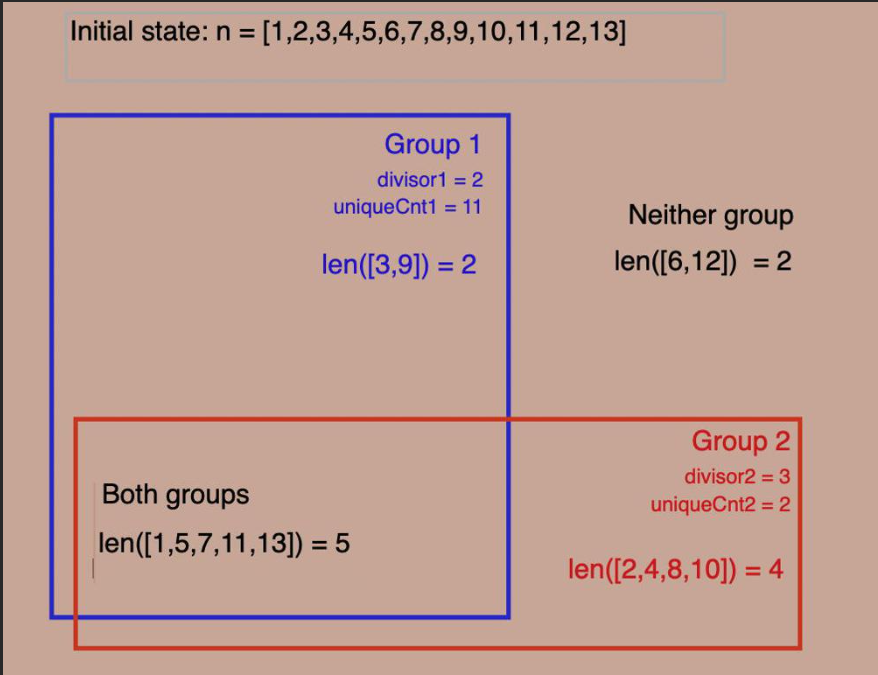

## Plan Explanation

Suppose, for example:
- `divisor1 = 2`, `uniqueCnt1 = 11`
- `divisor2 = 3`, `uniqueCnt2 = 2`

We need at least 13 elements in total in the two groups. Four elements would be eligible for either group ([1,5,7,11]), two for Group1 only ([3,9]), four for Group2 only ([2,4,8,10]), and two for neither group [6,12]. The diagram below summarizes:


Clearly, `n` needs to be increased by at least 4 (`n = 13 + 4 = 17`) in order for Group 1 to have 11 elements. We add 4 to `n` (so now `n = 17`), and determine the groups again:

- Group1: `len([3,9,15,21]) = 4`
- Group2: `len([2,4,8,10,14,16,20]) = 7`
- Both: `len([1,5,7,11,13,17,19]) = 7`
- Neither: `len([6,12,18]) = 3`

We continue to iterate in this fashion, ending up with `n = 21`:

- Group1: `len([3,9,15,21]) = 4`
- Group2: `len([2,4,8,10,14,16,20]) = 7`
- Both: `len([1,5,7,11,13,17,19]) = 7`
- Neither: `len([6,12,18]) = 3`

```python
class Solution:
    def minimizeSet(self, d1: int, d2: int, ct1: int, ct2: int) -> int:
        
        f = lambda x: (x+abs(x))//2                             

        n, prev, d = ct1 + ct2, 0, lcm(d1,d2)

        while n > prev:                    # keep going until we do not have to add more
            prev = n       

            l1, l2 = n//d2 - n//d, n//d1 - n//d   # l1, l2: length of group1, group2

            n += f(f(ct1 - l1) + f(ct2 - l2) - n + n//d + l2 + l1) # determine the increase in n

        return n
